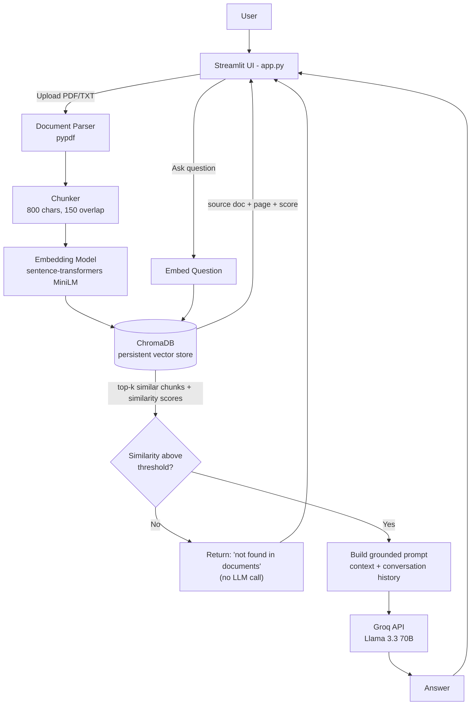

# Architecture Diagram

## Component responsibilities

| Component | File | Responsibility |
|---|---|---|
| UI | `app.py` | Upload flow, chat interface, displays answer/sources/confidence |
| Document Parser | `backend/document_processor.py` | Extracts text from PDF/TXT, splits into overlapping chunks |
| Vector Store | `backend/vector_store.py` | Embeds chunks, stores/retrieves them via ChromaDB |
| QA Orchestrator | `backend/qa.py` | Retrieval gate, prompt construction, confidence scoring |
| LLM Client | `backend/llm_client.py` | Thin wrapper around the Groq API |

## Data flow summary
`User → UI → Parser → Chunker → Embeddings → Vector Store → Retrieval → (grounding check) → LLM → Response`
