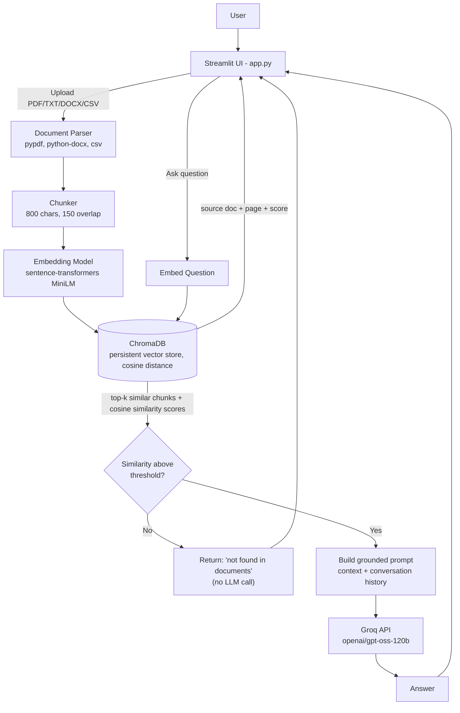

# Architecture Diagram

## Component responsibilities

| Component | File | Responsibility |
|---|---|---|
| UI | `app.py` | Upload flow, chat interface, displays answer/sources/confidence |
| Document Parser | `backend/document_processor.py` | Extracts text from PDF (pypdf), DOCX (python-docx), CSV, and TXT; splits into overlapping chunks |
| Vector Store | `backend/vector_store.py` | Embeds chunks, stores/retrieves them via ChromaDB using cosine distance |
| QA Orchestrator | `backend/qa.py` | Retrieval gate, prompt construction, confidence scoring |
| LLM Client | `backend/llm_client.py` | Thin wrapper around the Groq API (`openai/gpt-oss-120b`) |

## Data flow summary
`User → UI → Parser (PDF/DOCX/CSV/TXT) → Chunker → Embeddings → ChromaDB (cosine) → Retrieval → (grounding check) → Groq LLM → Response`

## Notes on key fixes made during development

- **Distance metric:** ChromaDB defaults to raw Euclidean (`l2`) distance, which produced distance values routinely above 1 even for correct matches, causing the confidence gate to incorrectly refuse to answer. The collection is now explicitly created with `metadata={"hnsw:space": "cosine"}` in `vector_store.py`, so distances stay in a predictable 0–2 range and the `similarity = 1 - distance` conversion works as intended.
- **LLM model:** the Groq model was switched from `llama-3.3-70b-versatile` (not available on all accounts) to `openai/gpt-oss-120b`, confirmed available and the strongest chat model on the account used for testing.
